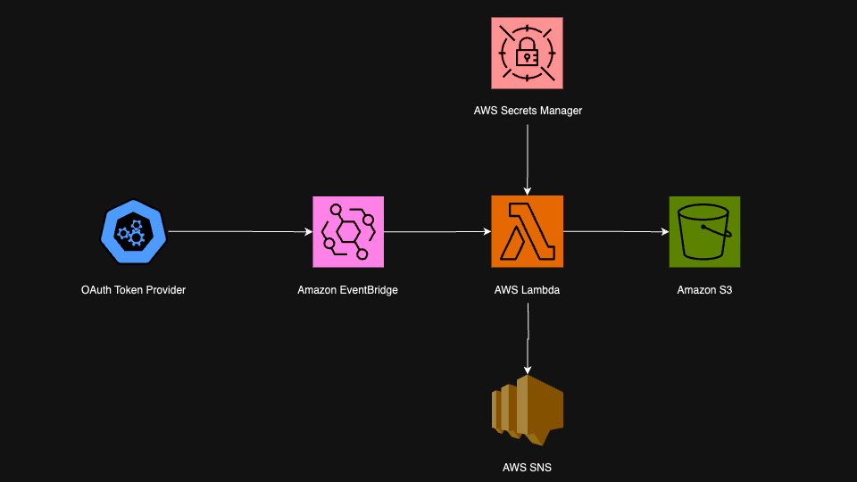

# AWS OAuth Key Collection (Initial)

## Project Overview
A Terraform-provisioned AWS pipeline that automates the secure retrieval, storage, and notification of OAuth access tokens from an external API. Using AWS Lambda to fetch tokens, S3 to store them, and SNS to send notifications, the process is securely managed with Secrets Manager and runs on a schedule defined by CloudWatch Events.

## Screenshot

## Table of Contents
- [Goals & MVP](#goals--mvp)
- [Tech Stack](#tech-stack)
- [How To Use](#how-to-use)
- [Design Goals](#design-goals)
- [Project Features](#project-features)
- [Additions & Improvements](#additions--improvements)
- [Learning Highlights](#learning-highlights)
- [Known Issues](#known-issues)
- [Challenges](#challenges)

## Goals & MVP
The goal of this project is to automate the retrieval and secure storage of OAuth access tokens from an external API. Using AWS services and Terraform, the project establishes a reliable, serverless process that retrieves tokens at regular intervals, stores them in S3, and notifies a subscriber via SNS.

## Tech Stack
- AWS Lambda
- AWS S3
- AWS SNS
- AWS IAM
- AWS Secrets Manager
- AWS CloudWatch Events (EventBridge)
- Terraform
- Python (Boto3)

## How To Use
1. Deploy the infrastructure using Terraform to set up the Lambda function, S3 bucket, SNS topic, Secrets Manager entries, and CloudWatch Events.
2. Store the necessary API credentials in AWS Secrets Manager (API key and API secret).
3. The Lambda function will automatically run according to the CloudWatch Events schedule, fetch the OAuth token, and store it in the designated S3 bucket.
4. Subscribers to the SNS topic will receive a notification upon each successful token retrieval and storage.

## Design Goals
- **Security**: Securely handle and store sensitive API credentials and tokens using AWS Secrets Manager and IAM roles.
- **Reliability**: Ensure token retrieval occurs on schedule, with error handling and notifications for failures.
- **Automation**: Fully automate the token retrieval and storage process to reduce manual intervention.
- **Scalability**: Design the solution to be adaptable for future integrations with additional APIs or data storage solutions.

## Project Features
- [x] Automatic retrieval and storage of OAuth tokens from an external API
- [x] Secure storage of tokens in an S3 bucket
- [x] Notifications sent via SNS on successful execution
- [x] Credential management using AWS Secrets Manager
- [x] Infrastructure provisioned with Terraform for consistent setup

## Additions & Improvements
- [ ] Integration with a downstream ETL pipeline to utilize the stored OAuth token for further data processing
- [ ] Database storage option to store OAuth tokens in an RDS database for centralized access
- [ ] Implement retry logic within the Lambda function for increased reliability
- [ ] Enhanced logging with CloudWatch Logs for better monitoring and debugging

## Learning Highlights
- Configuring AWS Secrets Manager to securely store and retrieve sensitive information in a Lambda environment
- Using Terraform to automate AWS infrastructure deployment and manage resources effectively
- Leveraging CloudWatch Events (EventBridge) to schedule Lambda function executions
- Learning to handle IAM role permissions across multiple AWS services for secure access

## Known Issues
- If the external API is unavailable, the Lambda function fails to retrieve the token and raises an error.
- Tokens stored in S3 do not have an expiration check; tokens may become invalid if not refreshed in a timely manner.

## Challenges
- Implementing secure storage and retrieval of secrets with Secrets Manager.
- Managing IAM permissions to allow Lambda access to S3, SNS, and Secrets Manager.
- Scheduling Lambda executions with CloudWatch Events to ensure timely token retrieval.

## Contact Me
- Visit my [LinkedIn](https://www.linkedin.com/in/obj809/) for more details.
- Check out my [GitHub](https://github.com/cyberforge1) for more projects.
- Or send me an email at obj809@gmail.com
 
Thanks for your interest in this project. Feel free to reach out with any thoughts or questions.
 
 
Oliver Jenkins © 2024
